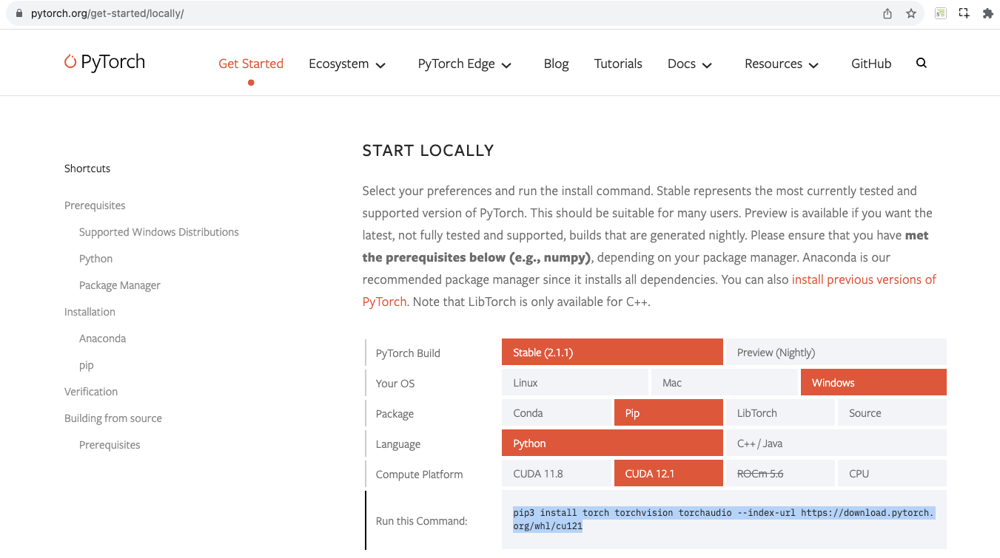

# KION
Видеоаналитика фильмов  

## Разворачивание окружения  
Для работы pytorch на мощностях видеокарты было установлено окружение NVIDIA CUDA 11.5 и библиотеки cuDnn 9.11.
Не следует использовать виртуальные среды venv, если нужна поддержка GPU ускорителя в библиотеке dlib. 
В текущем проекте было использовано виртуальное окружение conda.

### Последовательность установки  
Для установки используемых библиотек нужных версий выполните команду в рабочей папке проекта:
pip install -r requirements.txt.
Отдельно установите pytorch, исходя из особенной платформы, на которой разворачивается проект.
Установка pytorch:
Перейдите на сайт https://pytorch.org/get-started/locally/ и выберите необходимые кнопки pip:
  
Далее нужно установить библиотеку Dlib. Возможна установка библиотеки только с поддержкой CPU командой  
`pip install dlib`  
Но при наличии GPU ускорителя лучше установить dlib с поддержкой GPU.  
Для этого нужно установить на ПК Microsoft Visual Studio 2016-2019, установить CMake, прописать в системных переменных путь до CMake.  
После этого выполнить следующую последовательность команд:  
```conda install conda-forge::dlib```
